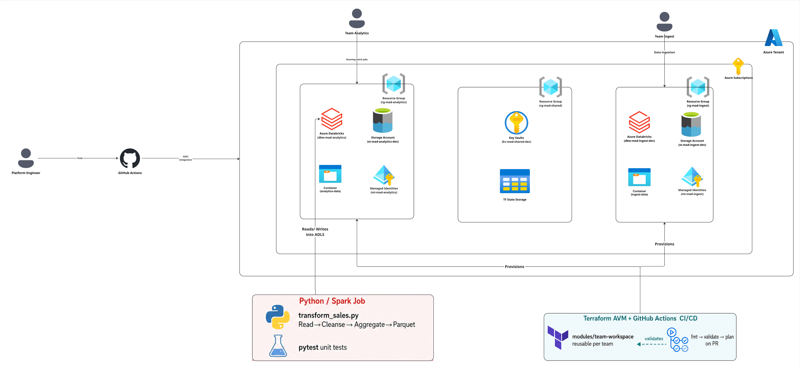

# MAD Platform – Technical Assignment

> **AI assistance note:** Perplexity AI assisted in generating the Terraform skeleton, Python boilerplate, and README structure. All code was reviewed and understood before submission.

---

## Design & Assumptions



### Architecture Overview

```
Azure Subscription
├── Resource Group: rg-mad-shared (shared infra: networking, Key Vault)
├── Resource Group: rg-mad-analytics
│   ├── Databricks Workspace: dbw-mad-analytics-<env>
│   ├── Storage Account: st-mad-analytics<env>
│   │   └── Container: analytics-data
│   └── Managed Identity: mi-mad-analytics
└── Resource Group: rg-mad-ingest
    ├── Databricks Workspace: dbw-mad-ingest-<env>
    ├── Storage Account: st-mad-ingest<env>
    │   └── Container: ingest-data
    └── Managed Identity: mi-mad-ingest
```

### Access Separation Strategy

- **One Databricks workspace per team** – total isolation of notebooks, jobs, clusters, and secrets.
- **One Storage Account + Container per team** – each team's Managed Identity is assigned `Storage Blob Data Contributor` on its own container only.
- **Azure RBAC** controls who can operate the workspace (Contributor on the Resource Group, scoped per team Azure Active Directory (AAD) group).
- **Databricks Unity Catalog** (future) or workspace-level ACLs enforce row/table-level access inside Databricks.
- **Key Vault** in the shared RG stores secrets referenced by both workspaces via secret scopes – teams cannot cross-read each other's secrets.

### Configuration layout

```
infra/
  modules/team-workspace/   # reusable per-team module
  envs/
    dev/
      analytics.tfvars      # team=analytics, env=dev
      ingest.tfvars          # team=ingest,     env=dev
    prod/
      analytics.tfvars
      ingest.tfvars
```

### Key assumptions

1. AAD groups `grp-mad-analytics` and `grp-mad-ingest` have been created and configured in terraform.tfvars.
2. A single Azure subscription is used; Resource Groups give billing and RBAC boundaries.
3. `Standard_LRS` storage is sufficient for dev; prod would use `ZRS` or `GRS`.
4. No VNet injection is modelled here – a next step for production.
5. Terraform state is stored in a shared Azure Storage backend (not configured locally).

---

## CI/CD Pipeline

### GitHub Actions

The repository includes an automated CI/CD pipeline using **GitHub Actions with OIDC authentication** (no static secrets required).

**Workflow:** `.github/workflows/terraform.yml`

**Triggers:**
- Pull requests touching `infra/**`
- Pushes to `main` branch touching `infra/**`
- Manual workflow dispatch

**Pipeline Steps:**
1. **Azure Authentication** – OIDC-based login using workload identity federation
2. **Terraform Format Check** – `terraform fmt -check -recursive`
3. **Terraform Init** – Initialize providers (backend-less for validation)
4. **Terraform Validate** – Validate configuration syntax
5. **Terraform Plan** – Generate execution plan for review

**Required GitHub Secrets:**
- `AZURE_CLIENT_ID` – Application (client) ID of the Azure AD app registration
- `AZURE_TENANT_ID` – Azure AD tenant ID
- `AZURE_SUBSCRIPTION_ID` – Target Azure subscription ID

**OIDC Configuration:**
The Azure AD app registration is configured with federated credentials for GitHub Actions, eliminating the need for client secrets. This provides:
- No secret rotation required
- Short-lived tokens (1 hour)
- Scoped to specific repository and branches
- Audit trail through Azure AD

---

## Terraform – How to Run

### Prerequisites

```bash
brew install terraform   # or https://developer.hashicorp.com/terraform/install
az login                 # authenticate to Azure
```

### Azure AD Groups

The following groups have been created:
- **grp-mad-analytics** (ID: `4e5caa45-ec19-433d-8242-564082acc8ad`)
- **grp-mad-ingest** (ID: `882fa592-906f-4471-8466-6703266e4244`)

To add users to these groups:
```bash
az ad group member add --group grp-mad-analytics --member-id <user-object-id>
az ad group member add --group grp-mad-ingest --member-id <user-object-id>
```

### Run plan for the analytics team (dev)

```bash
cd infra/envs/dev
terraform init
terraform plan -var-file=analytics.tfvars
```

### Add a third team

Create `infra/envs/dev/finance.tfvars`:

```hcl
team_name   = "finance"
environment = "dev"
location    = "westeurope"
aad_group_id = "<finance-aad-group-object-id>"
```

Then add a module call in `infra/envs/dev/main.tf`:

```hcl
module "finance" {
  source      = "../../modules/team-workspace"
  team_name   = var.team_name
  environment = var.environment
  location    = var.location
  aad_group_id = var.aad_group_id
}
```

Automated deployment** – extend CI/CD pipeline to run `terraform apply` automatically on main branch merges with approval gates.

1. **Remote state backend**: configure Azure Storage backend for Terraform state with locking and encryption.
2. **Secret rotation**: automate Key Vault secret rotation and link to Databricks secret scopes.
3. **Monitoring**: Azure Monitor + Databricks cluster metrics dashboards, alerting on job failures.
4. **Cost controls**: auto-termination policies on all clusters, budget alerts per Resource Group.
5. **Multi-environment strategy**: separate pipelines for dev/staging/prod with environment-specific approvals

## Python Job – How to Run

### Local (PySpark)

```bash
pip install pyspark pytest

# Run the job
cd jobs/ingest && python transform_sales.py \
  --input_path  ./sample_data/sales_raw \
  --output_path ./output/sales_clean \
  --env dev

# Run tests
pytest jobs/ingest/tests/
```

### On Databricks

1. Upload `jobs/ingest/transform_sales.py` as a Databricks notebook or attach as a library.
2. Set job parameters via Databricks Widgets or `spark.conf.set()`.
3. Configure the cluster to use the team Managed Identity for ADLS access.

---

## What I Would Do Next

1. **VNet injection** – private endpoints for Databricks and Storage to remove public internet exposure.
2. **Unity Catalog** – centralised data governance with fine-grained table/column permissions across workspaces.
3. **CI/CD pipeline** – GitHub Actions workflow: `terraform fmt` → `validate` → `plan` on PR, `apply` on merge to main.
4. **Secret rotation** – automate Key Vault secret rotation and link to Databricks secret scopes.
5. **Monitoring** – Azure Monitor + Databricks cluster metrics dashboards, alerting on job failures.
6. **Cost controls** – auto-termination policies on all clusters, budget alerts per Resource Group.
